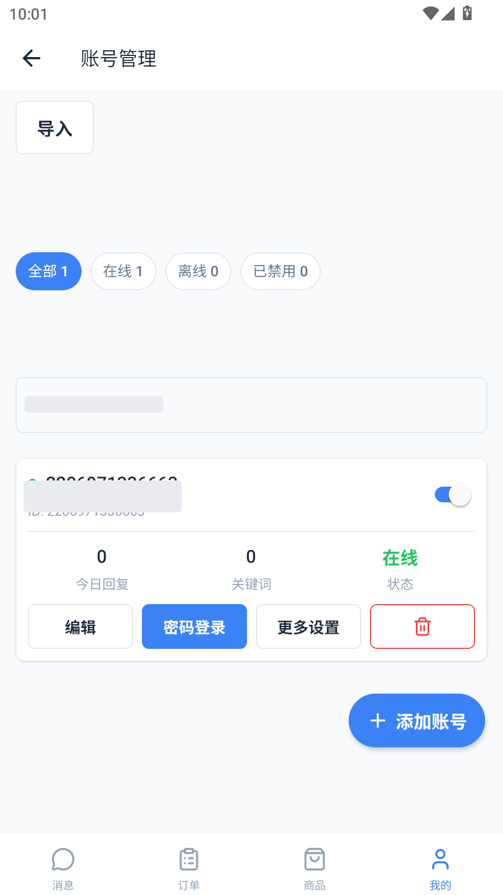
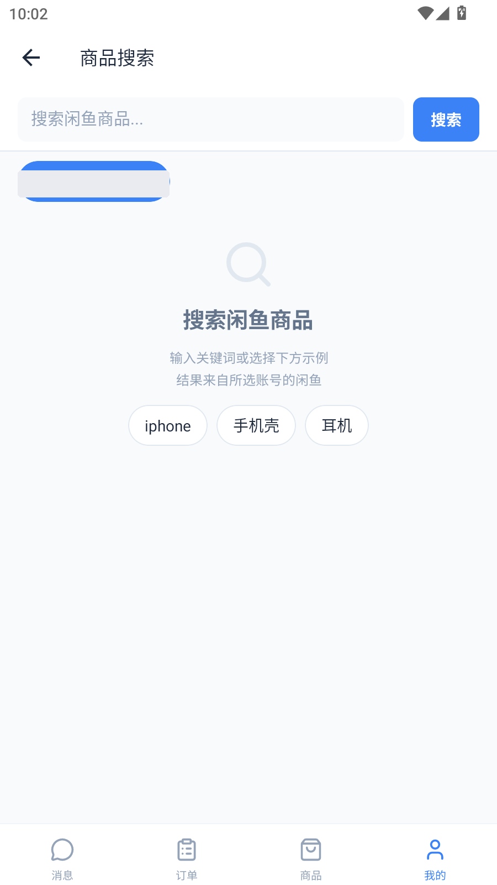
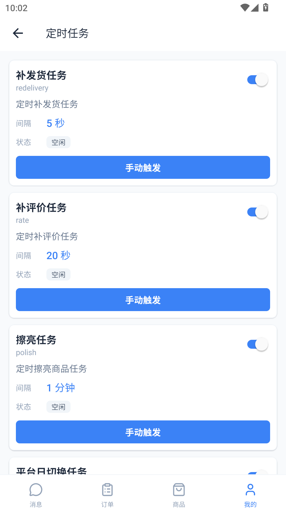

# 闲鱼管家 移动端 (xianyu-mobile)

> 闲鱼自动回复管理系统的 Android 客户端，基于 Expo + React Native 构建，与 [xianyu-auto-reply](../README.md) 后端完全解耦，用户自托管服务器即可使用。

## 功能概览

### 4 大 Tab + 50+ 页面

| Tab | 页面 | 截图 |
|---|---|---|
| 消息 | 会话列表（多账号切换 + WebSocket 实时推送 + 搜索 + 左滑已读/删除） |  |
| 订单 | 订单管理（状态筛选 Tab + 搜索 + 左滑手动发货/拉黑/复制单号/详情） |  |
| 商品 | 商品监控/卡券管理/发货规则 三段 Tab（卡券管理为完整页面内嵌）+ 统计卡可点跳转 |  |
| 我的 | 用户卡片 + 9 分组菜单 38 入口 + 搜索过滤 |  |

### 我的菜单 9 大分组（43 页）

| 分组 | 页面 |
|---|---|
| 核心功能 | 仪表盘、商品搜索、账号管理（扫码登录 + 9 开关 + AI 设置 + 默认回复 + 8 项高级配置 + 筛选 + Cookie 编辑） |
| 消息与回复 | 关键词管理、消息过滤、卡券管理（4 类型 + 对接 + 多规格）、黑名单管理（双 Tab） |
| 通知 | 通知渠道、消息通知绑定、通知管理 |
| 运营 | 公告、数据分析（10 指标卡 + 条形图 + 自定义日期）、风控日志（4 维筛选 + 滑块配置）、反馈（图片上传 + 分类 + 多轮回复）、广告管理（图片 + 支付） |
| 分销与推广 | 分销管理 + 子页（供货/卡券/下级）、爬虫任务、上新监控、监控分类/日志/兜底、商品发布、商品管理（列表 + 编辑 + 删除）、AI 上架（任务 + 历史 + 配置）、共享扫码 |
| 设置 | 系统设置（服务重启 + 菜单可见性 + 密码登录模式 + SMTP 测试）、个人设置（续期 + 到期日 + 结算记录） |
| 日志 | 日志查看（3 Tab + 筛选 + 清理）、APP 日志 |
| 管理 | 用户管理、定时任务（开关 + 间隔 + 手动触发）、数据管理（8 表预览 + 清空） |
| 其他 | 免责声明、使用教程、关于、服务器配置 |

### 亮点功能

| 功能 | 截图 | 说明 |
|---|---|---|
| 账号管理 |  | 扫码登录 + 密码登录 + 9 功能开关 + AI 设置 + 默认回复 + 同意后发货（提货链接 + 提货后通知提醒）+ 代理/消息等待/回复延迟/人脸验证/自动评价/禁止发货/退款注销 |
| 卡券管理 |  | 4 类型（固定文字/批量数据/API 接口/图片）+ 对接配置 + 多规格 + 延时发货 + 搜索 + 启用禁用 + 商品关联；商品 Tab 内嵌完整管理页 |
| AI 上架 |  | AI 文生文 + 文生图批量生成商品素材 → 素材库 → 批量发布上架，支持多服务商类型选择 + 进度轮询 + 取消 + 失败明细 |
| 数据分析 |  | 10 核心指标卡（涨跌幅红绿）+ 条形图分布可视化 + 自定义日期 + 账号切换 + 31 项字段中文化 |
| 仪表盘 |  | 可点击统计卡跳转 + 今日待办 + 账号概览 |
| 商品搜索 |  | 闲鱼市场商品搜索 + 账号选择 + 示例词 + 搜索历史 |
| 定时任务 |  | 任务列表 + 开关 + 间隔编辑 + 手动触发 |
| 商品管理 |  | 闲鱼已发布商品列表 + 点击编辑 + 长按删除 + 关联卡券 |

## 技术栈

| 维度 | 选型 | 版本 |
|---|---|---|
| 运行时 | React / React Native | 19.2.3 / 0.86.2 |
| 框架 | Expo (托管式 + 新架构) | ~57.0.16 |
| 路由 | expo-router (文件路由 + typedRoutes) | ~57.0.16 |
| 状态管理 | zustand | ^5.0.15 |
| API 层 | openapi-fetch + openapi-typescript | ^0.17.0 / ^7.13.0 |
| 语言 | TypeScript strict | ~6.0.3 |
| 图标 | lucide-react-native | ^1.34.0 |
| 安全存储 | expo-secure-store (token) + AsyncStorage (profile) | |
| 实时通信 | 原生 WebSocket（指数退避重连 + AppState 前台恢复） | |

## 设计系统

蓝白冷色系，对齐 Web 端风格：

- 主色 `#3B82F6`（Blue-500）+ slate 灰阶中性色
- light/dark 双模式
- 13 个自研 UI 组件：Button / Card / Badge / StatCard / FilterTabs / SwipeableRow / FAB / FormModal / EmptyState / DetailRow / Input / Loading / Alert
- 统一设计令牌（`lib/theme.ts` 单文件定义 colors / spacing / typography / radius / shadow）

## 项目结构

```
xianyu-mobile/
├── app/                    # expo-router 文件路由（52 个页面）
│   ├── (onboarding)/       # 登录前（4 页：登录/注册/找回密码/服务器配置）
│   └── (tabs)/             # 底部 Tab（messages/orders/products/mine）
│       └── mine/           # 功能大本营（43 页，9 菜单分组）
├── api/
│   ├── generated/          # OpenAPI 自动生成类型（勿手改）
│   └── wrappers/           # 31 个 API 封装（一业务域一文件）
├── components/             # 20 个组件（含 13 个 UI 库 + 7 个业务组件）
├── hooks/                  # usePagedList（分页列表 Hook）
├── lib/                    # theme/config/logger/ws/orderStatus/timeout
├── stores/                 # auth/accounts/config（zustand）
├── scripts/sync-api.ts     # API 类型同步脚本
├── docs/                   # 文档 + 截图
└── android/ ios/           # 原生工程（Expo prebuild 产物）
```

## 快速开始

### 环境要求

- Node.js v24+
- npm 11+
- Android SDK + Java 17
- MuMu 模拟器（或真机）

### 开发运行

```bash
cd xianyu-mobile
npm install
npx expo start --dev-client
# 模拟器：adb reverse tcp:8081 tcp:8081
# 真机：扫码连接 Metro
```

### Release APK 构建

因 Windows 中文路径会导致 Gradle 失败，需同步到 ASCII 路径副本构建：

```bash
# 1. 同步到 ASCII 路径
cp -r xianyu-mobile/* /path/to/xianyu-build/

# 2. 构建前确认 local.properties 使用正斜杠
# sdk.dir=C:/Users/YourUser/AppData/Local/Android/Sdk

# 3. 构建
cd /path/to/xianyu-build/android
./gradlew assembleRelease

# 4. 产物
android/app/build/outputs/apk/release/app-release.apk
```

### API 类型同步

```bash
# 从后端 OpenAPI spec 重新生成类型
npm run sync-api
```

## 与后端的关系

- **独立项目**：xianyu-mobile 是独立项目，默认对 xianyu-auto-reply 后端零修改；「提货后通知」为可选增强，需 3 个后端文件的配套改动与 2 个新增字段（见仓库根 PR 说明）
- **OpenAPI 契约驱动**：从后端 `/openapi.json` 自动生成 TypeScript 类型
- **自托管**：用户在 APP 内配置自己的服务器地址，支持多 profile 切换
- **认证兼容**：JWT Bearer Token，与后端 auth 接口完全兼容

## 已知陷阱

1. **Boolean("false") === true**：后端返回字符串 `"false"` 不能直接用 `Boolean()` 转换，需 `=== true || === 'true'`
2. **openapi-fetch onResponse 不能返回 response**：RN Response polyfill 不过 `instanceof` 检查，会触发 "must return new Response()"
3. **Windows 中文路径 fs.cpSync 静默失败**：Node 24 在中文路径下跨盘拷贝会静默失败，需 patch 加 xcopy 降级
4. **local.properties 反斜杠转义**：Java Properties 会转义 `\`，SDK 路径必须用正斜杠 `C:/Users/...`
5. **expo-modules-autolinking 跳过根目录**：for 循环条件跳过盘符根的 package.json，需 patch 改为 while(true)
6. **SafeAreaView edges 与 TabBar 冲突**：pushed 页面的 SafeAreaView 加 `edges={['left','right','bottom']}` 避免 AppBar 下方死区

## 文档索引

| 文档 | 说明 |
|---|---|
| [docs/api-schema.md](docs/api-schema.md) | 103 个写操作接口 Schema + 422 陷阱速查 |
| [docs/TEST_REPORT_v1.0.7.md](docs/TEST_REPORT_v1.0.7.md) | 3 轮审查测试报告（26 页全量扫描） |
| [../README.md](../README.md) | 后端 + Web 前端 README |

## 版本

当前版本：1.14（versionCode 15）

### v1.13 → 1.14 更新记录

- 商品编辑页大改版：折叠卡片式布局，长表单按区块收起/展开
- 商品通用查询按钮配置入口（配合后端「查询按钮」功能，买家在提货页可一键查余额等）
- 卡券关联页交互优化
- 提货页支持卡密 txt 下载
- versionCode 修正为 15（避免低版本号无法覆盖安装）

### v1.0.7 → 1.13 更新记录

- 商品 Tab 融合完整卡券管理页（不再概要+跳转）
- 提货后通知：买家同意提货发卡成功后，自动向买家发送确认收货提醒（账号级，默认关闭）
- AI 上架配置支持服务商类型选择（provider_type）
- 修复假功能，补齐与 Web 管理端的功能差距（v1.0.8 专项）
- 卡券列表直接显示具体内容；loadMore 加载守卫修复列表抖动
- 消息页会话列表底部遮挡修复；release 构建强制 NODE_ENV=production
- 全部截图与提示文案隐私脱敏

## 许可证

继承 [xianyu-auto-reply](../LICENSE) 的 AGPL-3.0 许可证。
